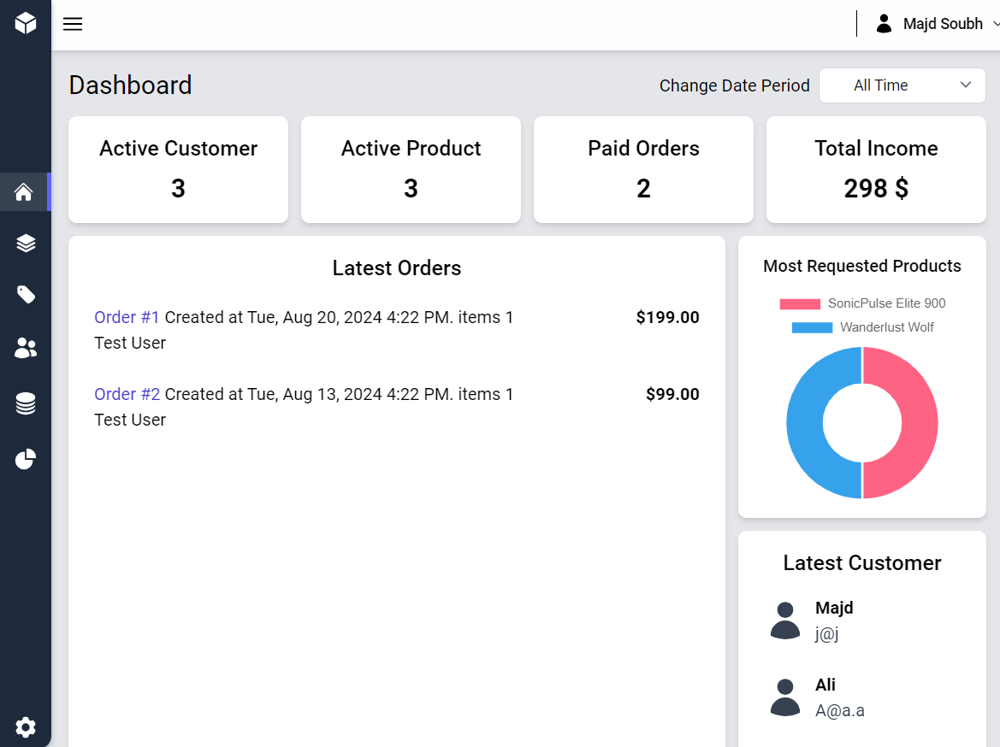
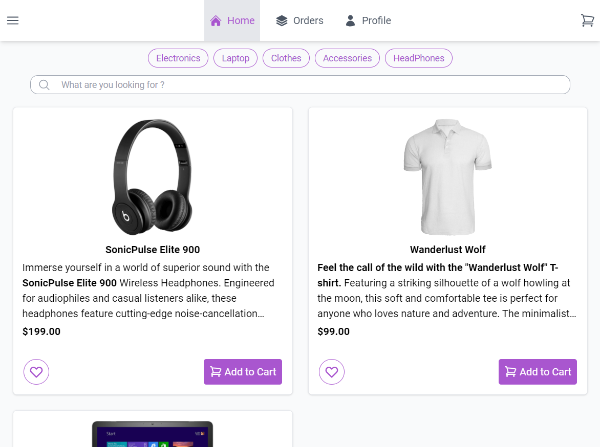
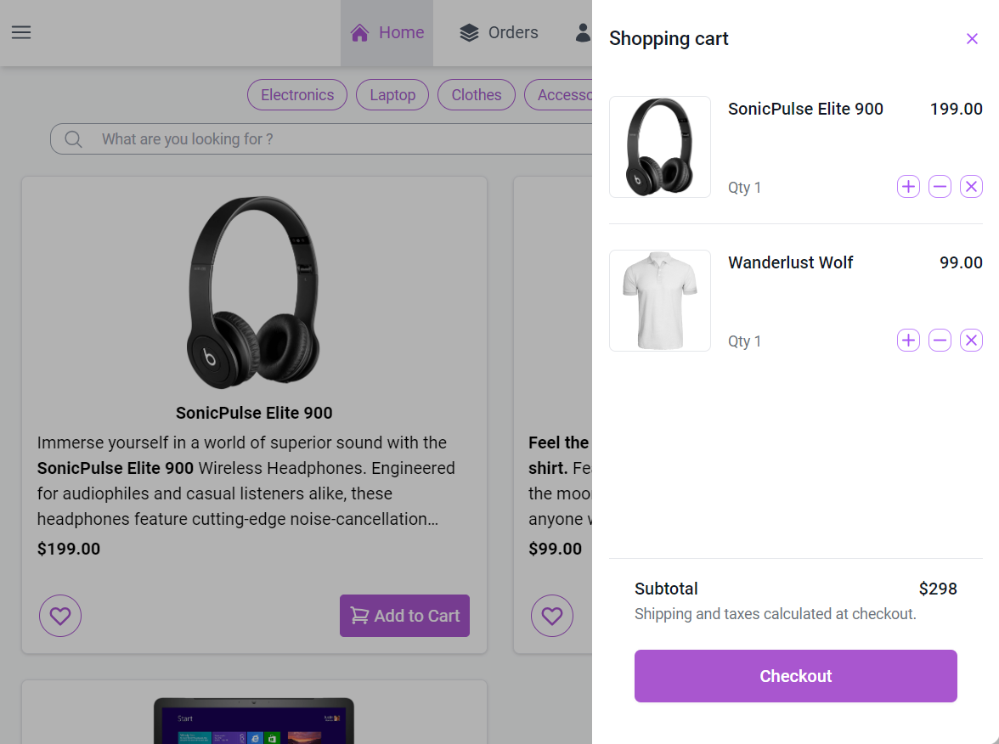
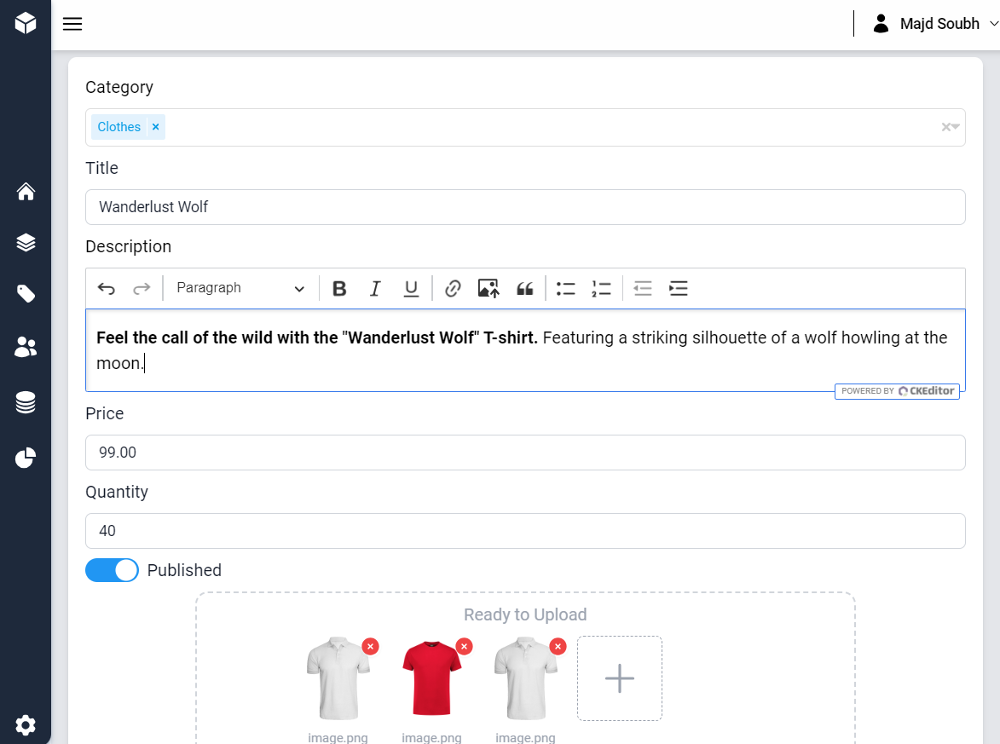
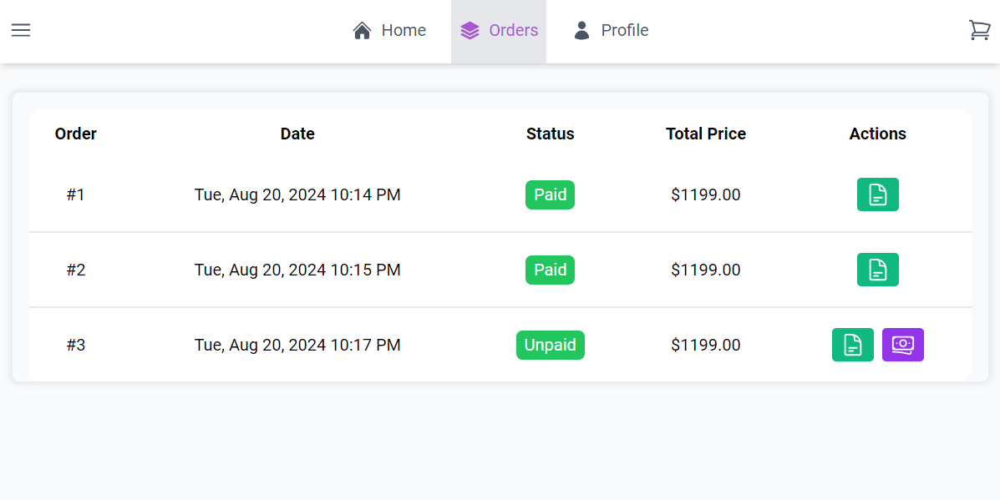
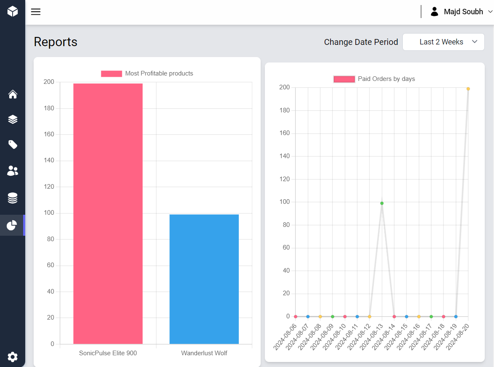

## E-commerce

The online store application enables administrators to add products and view reports, while allowing users to purchase products. It is built using Vue and Vuex for the front end, styled with Tailwind CSS, and uses Laravel for the back end.

## Installation

### Method 1: Manual Installation

#### Laravel

```shell
   # Enter the directory
   cd backend

   # Install dependencies
   composer install

   # Create .env file with your configurations
   cp .env.example .env

   # Generate new key
   php artisan key:generate

   # Upload the database and seeding
   php artisan migrate --seed --force

   # Run server
   php artisan serve

   # Open new terminal or shell and start Laravel Reverb
   php artisan reverb:start

```

#### Vue

```shell
   # Enter the directory
   cd frontend

   # Install npm dependencies
   npm install

   # Create .env file with your configurations
   # Set your VITE_API_BASE_URL (laravel server URL)
   # Set your VITE_BASE_URL (current frontend server URL)
   cp .env.example .env

   # Run Vite server
   # You may need to change package.json 'dev script' and modify --host and --port to be match with VITE_BASE_URL
   npm run dev
```

### Method 2: Installation Using Docker

This method allows you to run the entire application using Docker containers for Laravel, Vue, and MySQL.

#### Prerequisites

- Docker and Docker Compose installed on your machine.

#### Laravel

```shell
   # Enter the directory
   cd backend

   # Create a .env file with your configurations (you can keep the pre-configured settings for compatibility with other Docker containers)
   cp .env.example .env

```

#### Vue

```shell
   # Enter the directory
   cd frontend

   # Create a .env file with your configurations (you can keep the pre-configured settings for compatibility with other Docker containers)
   cp .env.example .env

```

#### Docker

```shell
   # Build and start new container
   docker-compose up --build
```

## Run Tests

```shell
   # Enter the directory
   cd backend

   # Open new terminal or shell and start Laravel Reverb
   php artisan reverb:start

   # Run all tests using pest
   ./vendor/bin/pest


```

## Screen Shots

<p align="center">







</p>
